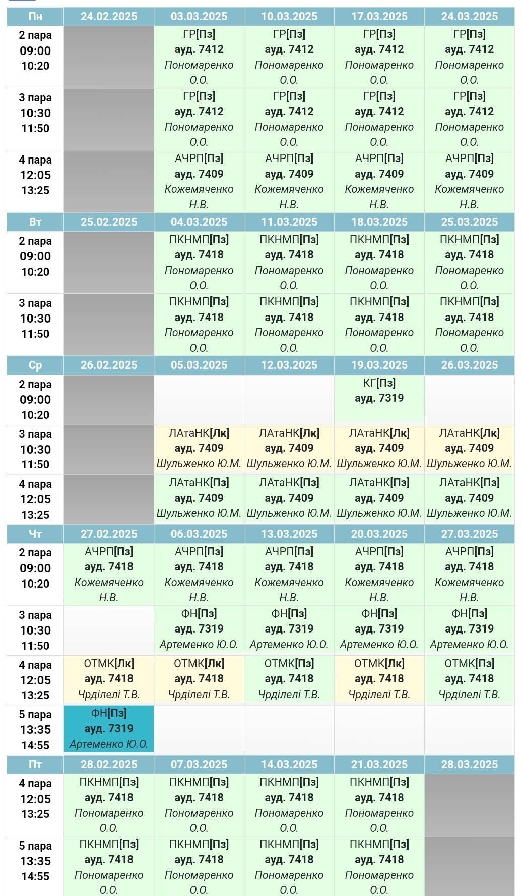
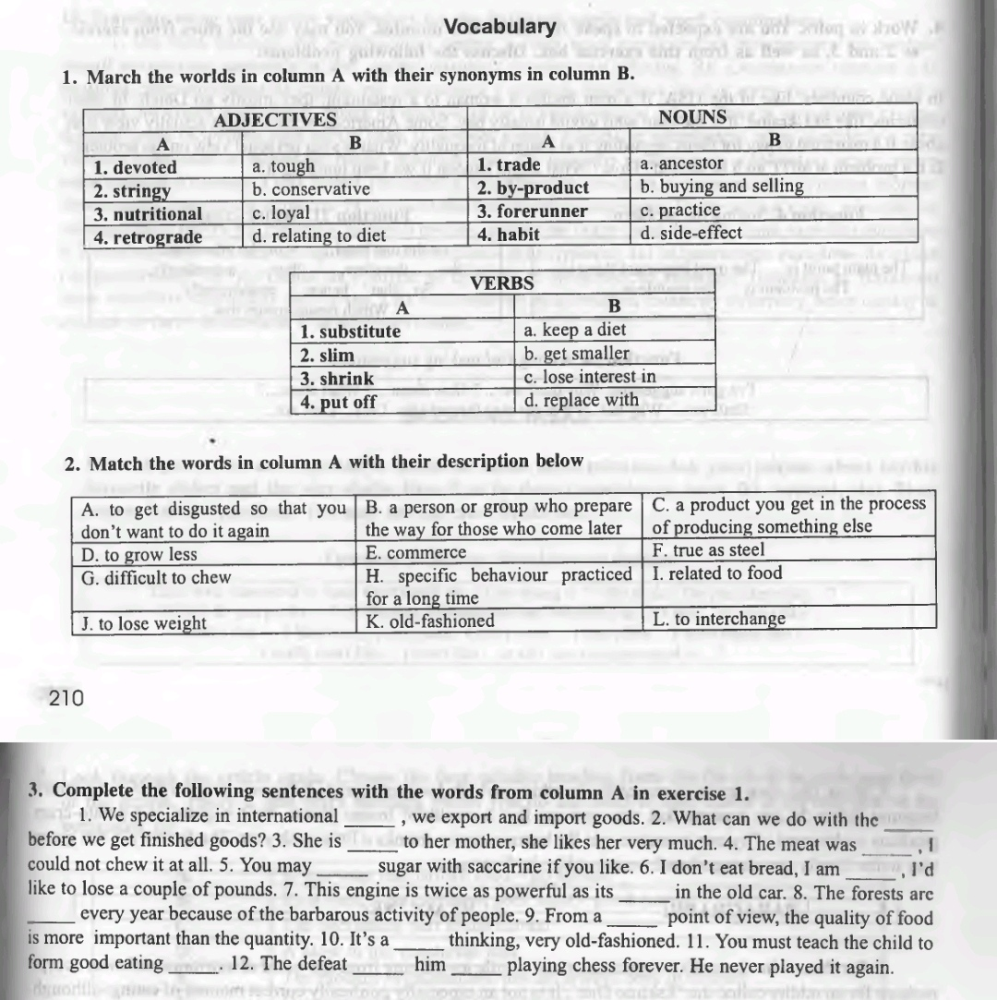
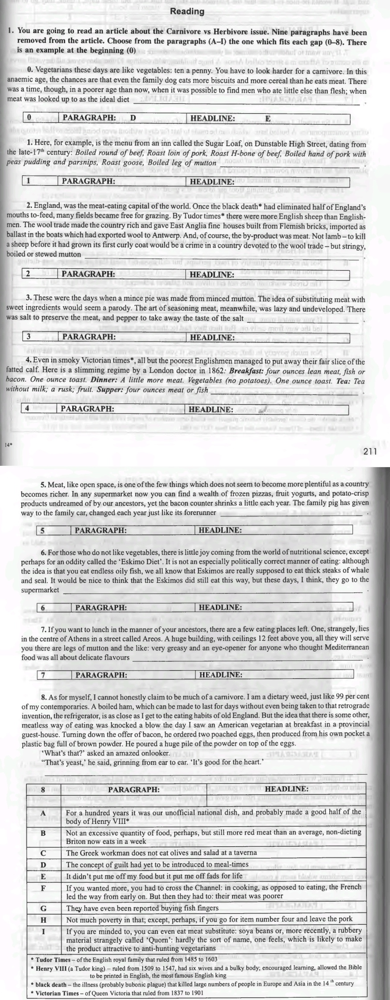
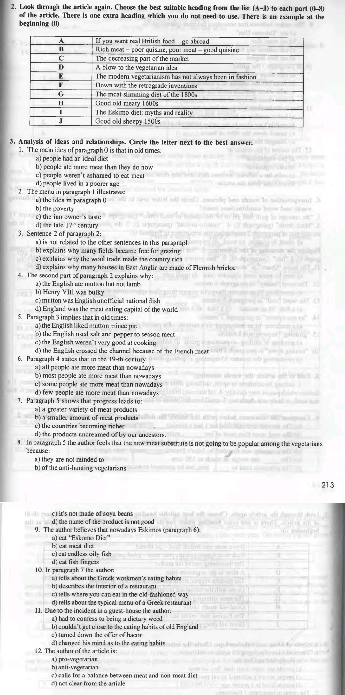
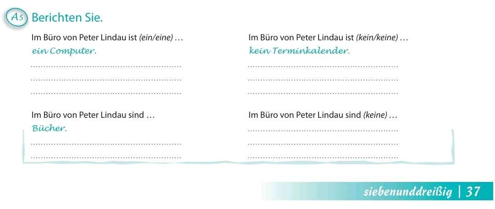
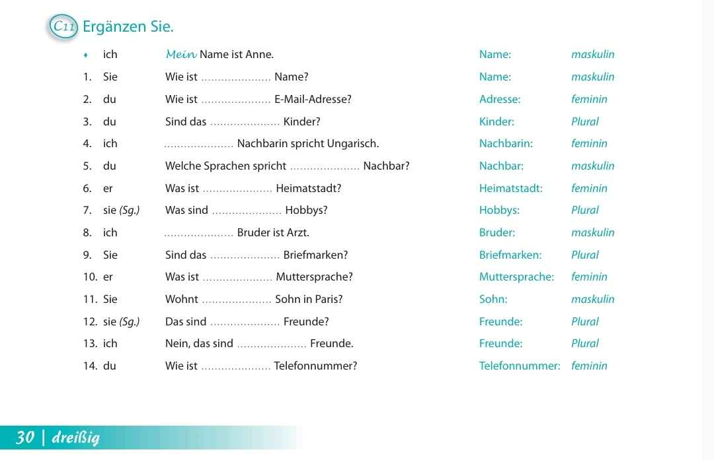
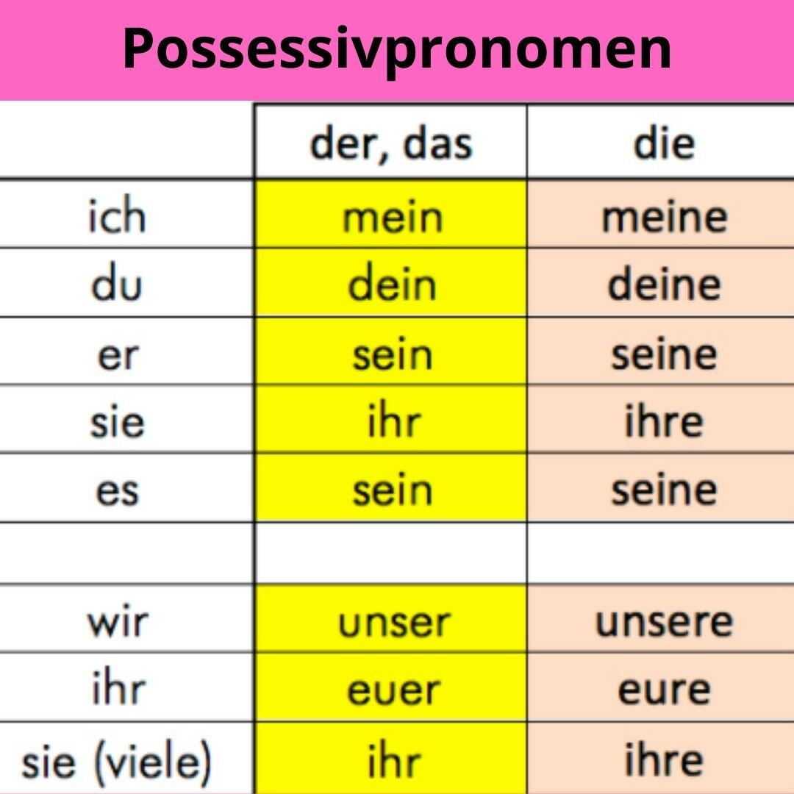

# Сторінка
Щось корисне, [мабуть](https://www.youtube.com/watch?v=GFz6KqZurFY)    

## Zoom посилання
* [Література](http://krnu.org/mod/url/view.php?id=24220)
* [Мовна комунікація](http://krnu.org/mod/url/view.php?id=29313)
* [АЧРП](http://krnu.org/mod/url/view.php?id=29123)
* [Фонетика](http://krnu.org/mod/url/view.php?id=45463)
* [Граматика](http://krnu.org/mod/url/view.php?id=29200)
* [Німецька](http://krnu.org/mod/url/view.php?id=29221)    

## Домашнє завдання

[Спільне](#спільне)
* [Література](#література)
* [Мовна комунікація](#мовна-комунікація)  

[1-ша підгрупа](#1-ша-підгрупа)
* [Розклад занять](#розклад-занять)  

* [АЧРП](#ачрп)
* [Фонетика](#фонетика)
* [Граматика](#граматика)
* [Німецька](#німецька)  

[2-га підгрупа](#2-га-підгрупа)
* [Розклад занять](#розклaд-занять)  

* [АЧРП](#ачpп)
* [Фонетика](#фонетикa)
* [Граматика](#граматикa)
* [Німецька](#німецькa)

## Спільне
### Література
Виконати завдання звідси:  
* [Англосаксонська поема «Беовульф» як зразок архаїчного героїчного епосу раннього середньовіччя](http://krnu.org/mod/assign/view.php?id=20408)
* [Німецький класичний героїчний епос «Пісня про Нібелунгів»: специфіка та характерні риси](http://krnu.org/mod/assign/view.php?id=20409)
* [Придворно-лицарська література: лицарський роман](http://krnu.org/mod/assign/view.php?id=24546)

### Мовна комунікація
Подивитися презентацію

Розповісти про одну функцію мови    

## 1-ша підгрупа

### Розклад занять
    

### АЧРП
"Добрий ранок, нажаль змушена бути на нарадах в університеті під час нашої пари, тому надсилаю наступне завдання: підручник Карабана p. 210-211 Ex. 1, 2, 3; p. 211-212 Text and Ex. 2, 3 p. 213"    

### Фонетика

### Граматика

### Німецька
Записати слова з цього файлу [Wörterbuch 2.docx](https://cdn.discordapp.com/attachments/1278376988490596466/1343892648850755584/Worterbuch_2.docx?ex=67beed0f&is=67bd9b8f&hm=07fd70a3f609820adf7c2a8c35710b394792729750f4c85e2e263b098418e143&)  
Та зробити вправу 5 на сторінці 37     

## 2-га підгрупа

### Розклaд занять
    

### АЧPП
"Добрий ранок, нажаль змушена бути на нарадах в університеті під час нашої пари, тому надсилаю наступне завдання: підручник Карабана p. 210-211 Ex. 1, 2, 3; p. 211-212 Text and Ex. 2, 3 p. 213"   

### Фонетикa
Подивитись ці три відео   

### Граматикa
Повторити часи та reported speech (непряма мова)

### Німецькa
Повторити словничок (пізніше буде тут), весь пройдений матеріал  
Виконати завдання завдання на картинці     

Шматочок німецької 
