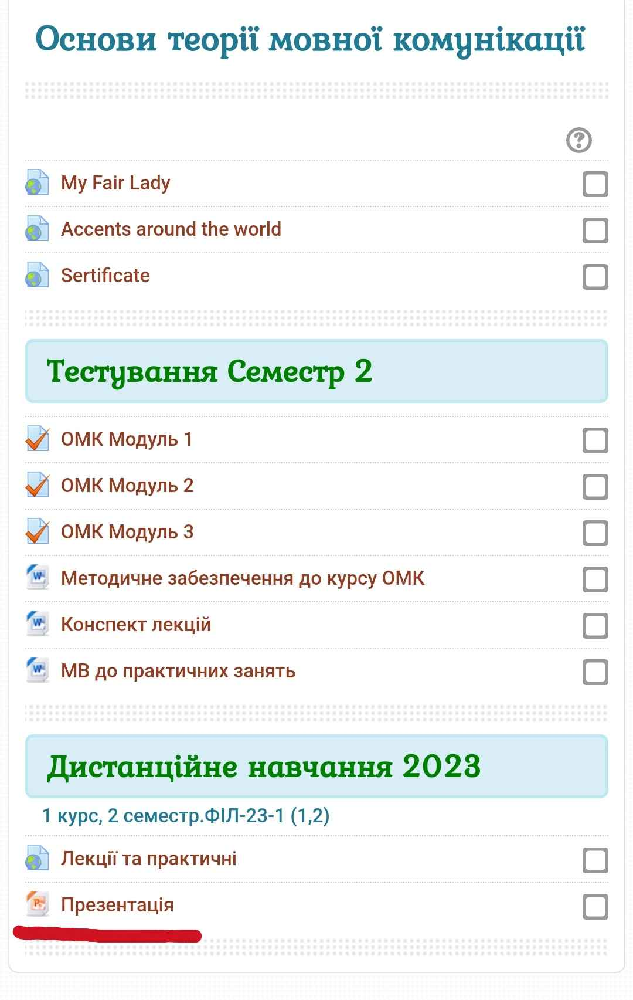
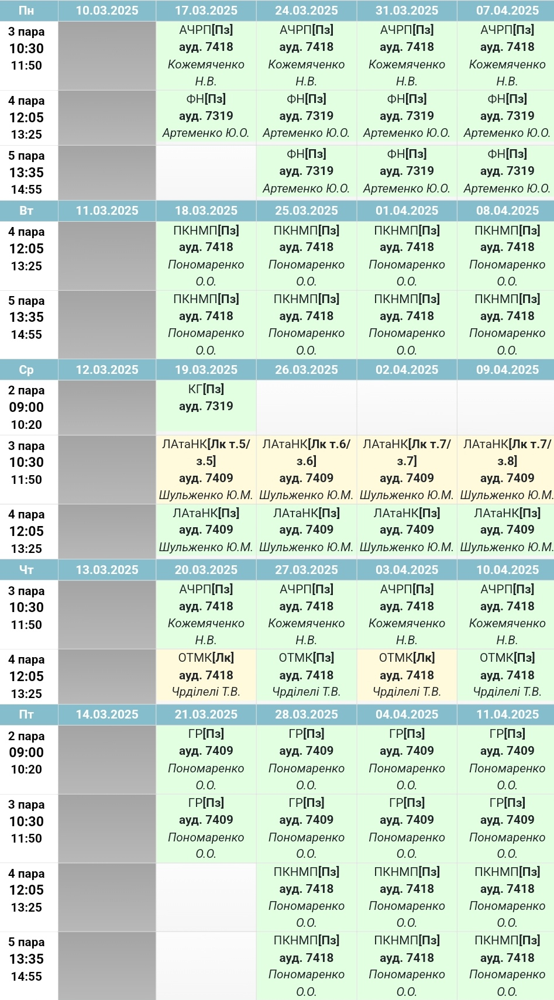
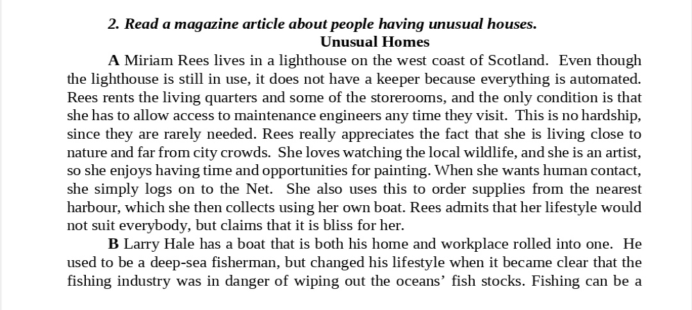
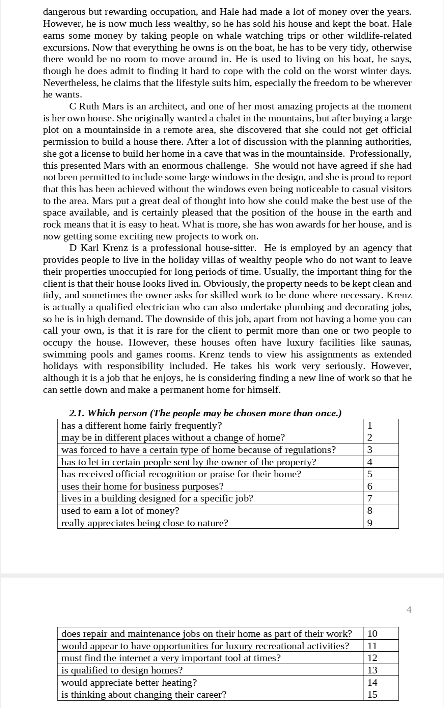
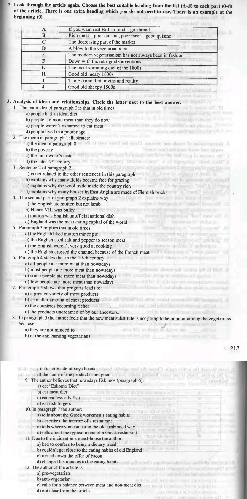
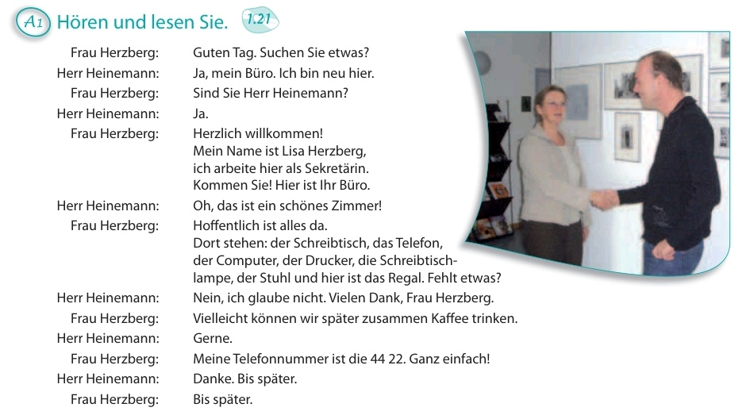

# Сторінка
Щось корисне, [мабуть](https://www.youtube.com/watch?v=GFz6KqZurFY)    

## Zoom посилання
* [Література](http://krnu.org/mod/url/view.php?id=24220)
* [Мовна комунікація](http://krnu.org/mod/url/view.php?id=29313)
* [АЧРП](http://krnu.org/mod/url/view.php?id=29123)
* [Фонетика](http://krnu.org/mod/url/view.php?id=45463)
* [Граматика](http://krnu.org/mod/url/view.php?id=29200)
* [Німецька](http://krnu.org/mod/url/view.php?id=29221)    

## Домашнє завдання

[Спільне](#спільне)
* [Література](#література)
* [Мовна комунікація](#мовна-комунікація)  

<!-- [1-ша підгрупа](#1-ша-підгрупа)
* [Розклад занять](#розклад-занять)  

* [АЧРП](#ачрп)
* [Фонетика](#фонетика)
* [Граматика](#граматика)
* [Німецька](#німецька)   -->

[2-га підгрупа](#2-га-підгрупа)
* [Розклад занять](#розклaд-занять)  

* [АЧРП](#ачpп)
* [Фонетика](#фонетикa)
* [Граматика](#граматикa)
* [Німецька](#німецькa)

## Спільне
### Література
Виконати завдання звідси:  
* [Епоха Відродження у літературі Німеччини](http://krnu.org/mod/assign/view.php?id=24685)

### Мовна комунікація
Подивитися презентацію

Розповісти про одну функцію мови    

<!-- ## 1-ша підгрупа

### Розклад занять

### АЧРП

### Фонетика

### Граматика

### Німецька -->

## 2-га підгрупа

### Розклaд занять
    

### АЧPП
Essay: Ukrainian cuisine: 4 best-known dishes    

"Добрий ранок, нажаль змушена бути на нарадах в університеті під час нашої пари, тому надсилаю наступне завдання: підручник Карабана p. 210-211 Ex. 1, 2, 3; p. 211-212 Text and Ex. 2, 3 p. 213"   

### Фонетикa
Подивитись ці три відео   

### Граматикa
Повторити часи та reported speech (непряма мова)

### Німецькa
Потрохи вчити [словничок](https://cdn.discordapp.com/attachments/1344249786777468990/1346234528678674432/Worterbuch_2.docx?ex=67c7721b&is=67c6209b&hm=43c4c238fbaf5f428baaf9b3965867c2624519a3fca36ce62f14ca61a1d9014f&) та весь пройдений матеріал (можлива контрольна)  
Виконати завдання на картинці > до нього [це аудіо](https://t.me/c/2234588091/24819)     
ТА ВИВЧИТИ ЦЕЙ ДІАЛОГ НАПАМ'ЯТЬ 

