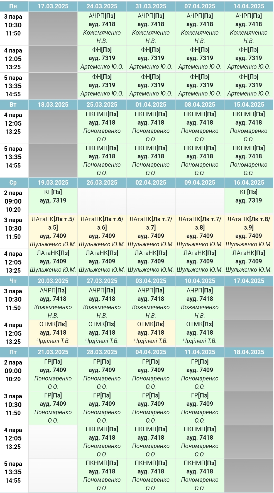
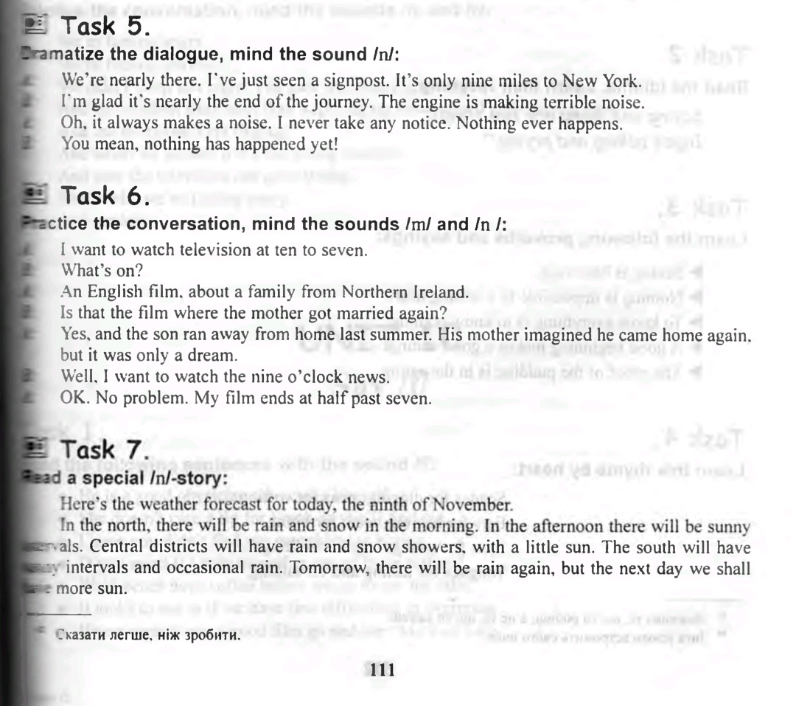
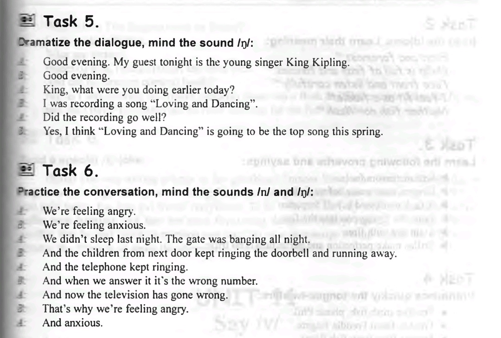

# Сторінка
Щось корисне, [мабуть](https://www.youtube.com/watch?v=GFz6KqZurFY)    

## Zoom посилання
* [Література](http://krnu.org/mod/url/view.php?id=24220)
* [Мовна комунікація](http://krnu.org/mod/url/view.php?id=29313)
* [АЧРП](http://krnu.org/mod/url/view.php?id=29123)
* [Фонетика](http://krnu.org/mod/url/view.php?id=45463)
* [Граматика](http://krnu.org/mod/url/view.php?id=29200)
* [Німецька](http://krnu.org/mod/url/view.php?id=29221)    

## Домашнє завдання

[Спільне](#спільне)
* [Література](#література)
* [Мовна комунікація](#мовна-комунікація)  

[1-ша підгрупа](#1-ша-підгрупа)
* [Розклад занять](#розклад-занять)  

* [АЧРП](#ачрп)
* [Фонетика](#фонетика)
* [Граматика](#граматика)
* [Німецька](#німецька)  

[2-га підгрупа](#2-га-підгрупа)
* [Розклад занять](#розклaд-занять)  

* [АЧРП](#ачpп)
* [Фонетика](#фонетикa)
* [Граматика](#граматикa)
* [Німецька](#німецькa)

## Спільне
### Література
Виконати завдання в телеграмі в группі з куратором

### Мовна комунікація
Пройти [курс](https://prometheus.org.ua/prometheus-free/resisting-media-manipulation/) (за бажанням) та надіслати сертифікат на пошту: tat.chrdileli@gmail.com

## 1-ша підгрупа

### Розклад занять
    

### АЧРП
Find out several variants of boat houses (in Europe), floating houses, cave city, igloo, tree house.

### Фонетика

### Граматика

### Німецька

## 2-га підгрупа

### Розклaд занять
    

### АЧPП
Текст та завдання на картинці: 

### Фонетикa
Голосовим повідомленням здати в телеграмі Артеменко (десь тут контакт) тексти що казали на парі  

Зробити завдання 4 на 97 сторінці, та 5 6 7 на 100 до цих завданнь йдуть [аудіо](https://drive.google.com/drive/mobile/folders/1wS6gswOli-StjoNAvlZ7RwPoZV7mU7x8) < скачати .rar та розпакувати і прослухувати на CD\_1/2.mp3 Unit 1 на 6 хвилині і  27 сеiкунді  

Подивитись ці три відео   

### Граматикa
[Часи](https://grammarway.com/ua/all-verb-tenses)    

Пройти тест по [reported speech](http://krnu.org/mod/quiz/view.php?id=20635)

Повторити reported speech (непряма мова) та зробити завдання на картинці 

### Німецькa
Вивчити слова з Wörterbuch 1.docx (словник по Kapitel 1 в групі з Куратором)    

ТА ВИВЧИТИ ЦЕЙ ДІАЛОГ НАПАМ'ЯТЬ 

